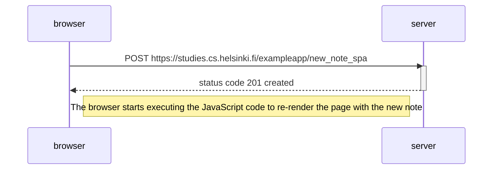

```mermaid
sequenceDiagram
    participant browser
    participant server

    browser->>server: POST https://studies.cs.helsinki.fi/exampleapp/new_note_spa
    activate server
    server-->>browser: status code 201 created
    deactivate server

    Note right of browser: The browser starts executing the JavaScript code to re-render the page with the new note

```

